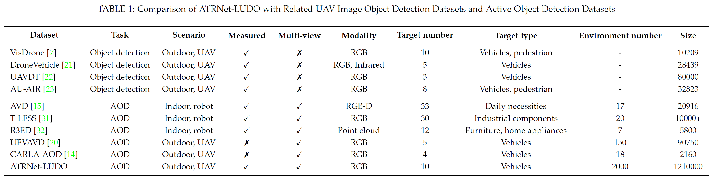

# ATRNet-LUDO
### A Large-Scale Real-World Dataset and Benchmark for UAV Ground Active Object Detection

---

## ✨ Highlights
- **First large-scale real-world UGAOD dataset**: 121,000 multi-view panoramic aerial images + 1.21 million single-target patches, covering 10 vehicle categories across 40 real scenarios.
- **Multi-task support**: Enables 5 representative perception tasks: single/multi-target AOD, occluded target detection, and UAV visual localization.
- **Standardized benchmark**: Formal evaluation protocol and metrics for UAV-ground single-target active object detection, enabling fair comparison of policy learning methods.
- **Strong baseline**: A novel World Model-driven Policy Learning (WMPL) approach built on AOD-JEPA, significantly boosting cross-scenario policy generalization.

---

## 📊 Dataset Overview

---

## 🖼️ Visualization Examples

Visualization of panoramic aerial images, local target patches and annotation files from the ATRNet-LUDO dataset

---

## 📥 Download & Data Structure

### Download Links
| Data Split | Size | Link |
|------------|------|------|
| Full dataset (all panoramas + patches) | ~3 TB | (coming soon) |
| Mini subset (for quick validation) | ~3 GB | [Google Drive]() |
| Evaluation code & benchmark toolkit | - | [GitHub](coming soon) |

### File Structure

Click to expand full directory tree

ATRNet-LUDO/
  ├── 1/ # 121,000 multi-view panoramic aerial images
  │ ├── scene_001/ # Each folder corresponds to one real-world scenario
  │ │ ├── img_00001.jpg
  │ │ └── ...
  │ ├── scene_002/
  │ └── ...
  ├── 2/
  │ ...
  ├── 10/
  ├── k/

### Folder Explanation
1. `panoramic/`: Full multi-angle aerial panoramic images collected from 40 diverse traffic scenes.
2. `patches/`: Cropped single-object patches extracted for occlusion-aware detection research.
3. `annotations/`: Label files including bounding boxes, occlusion flags and category IDs.
4. `splits/`: Standard data division files for consistent benchmark evaluation.

